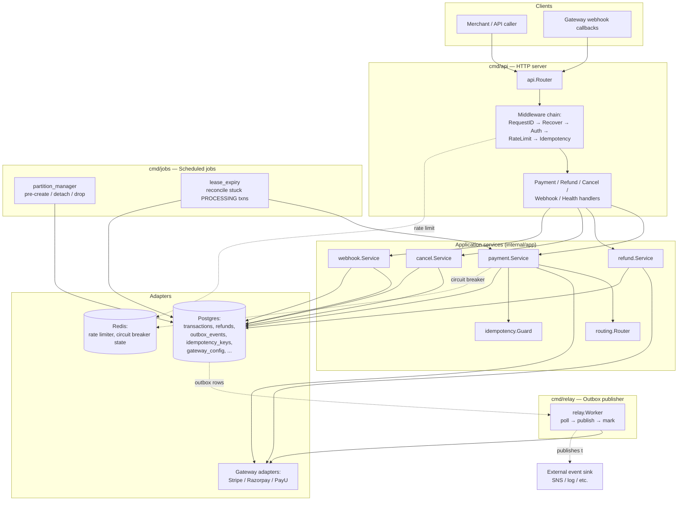
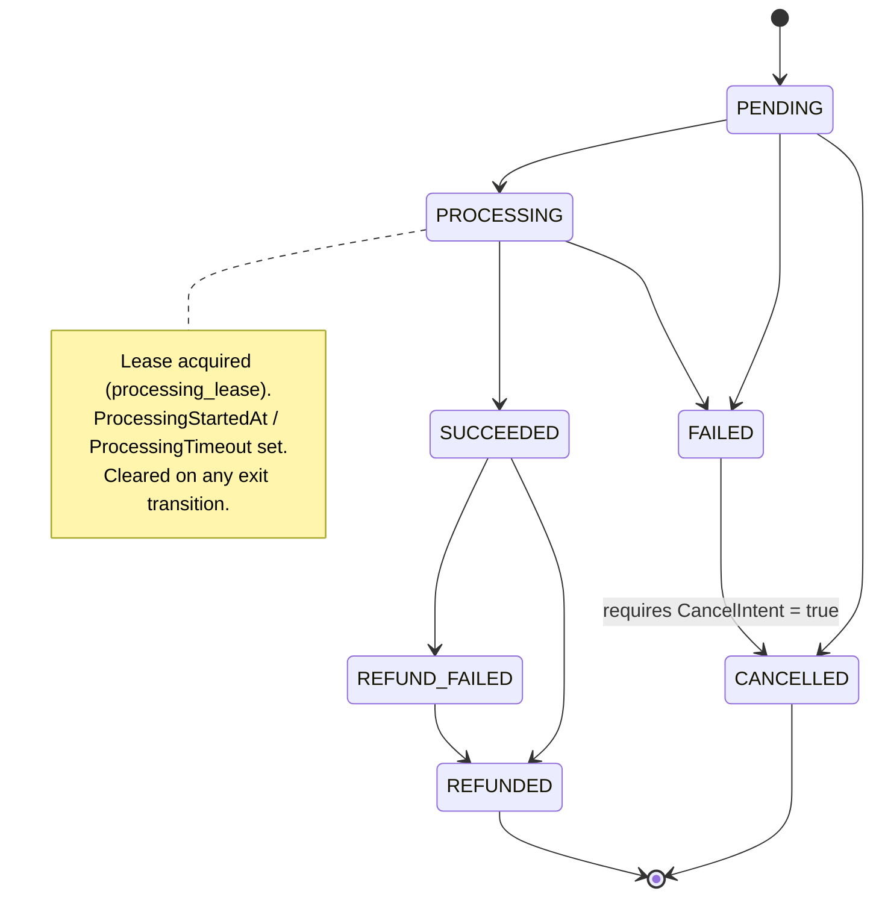
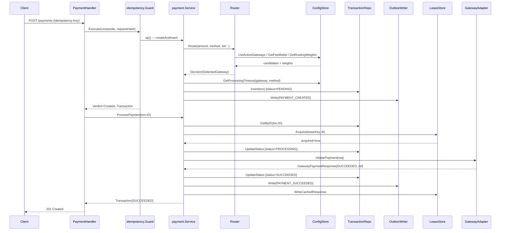
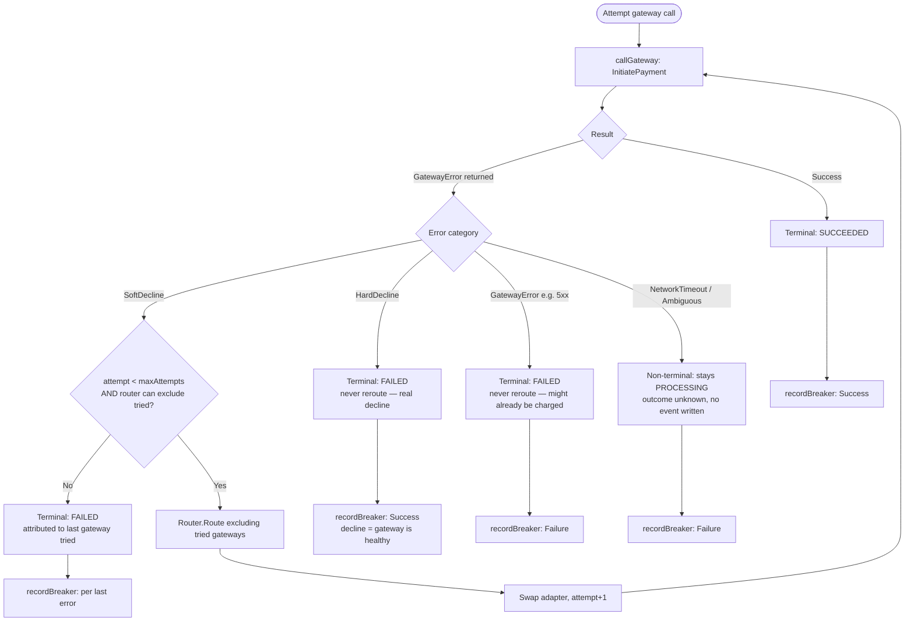
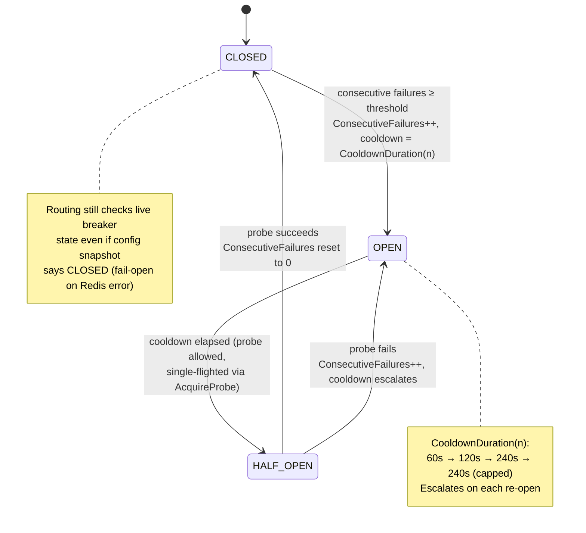
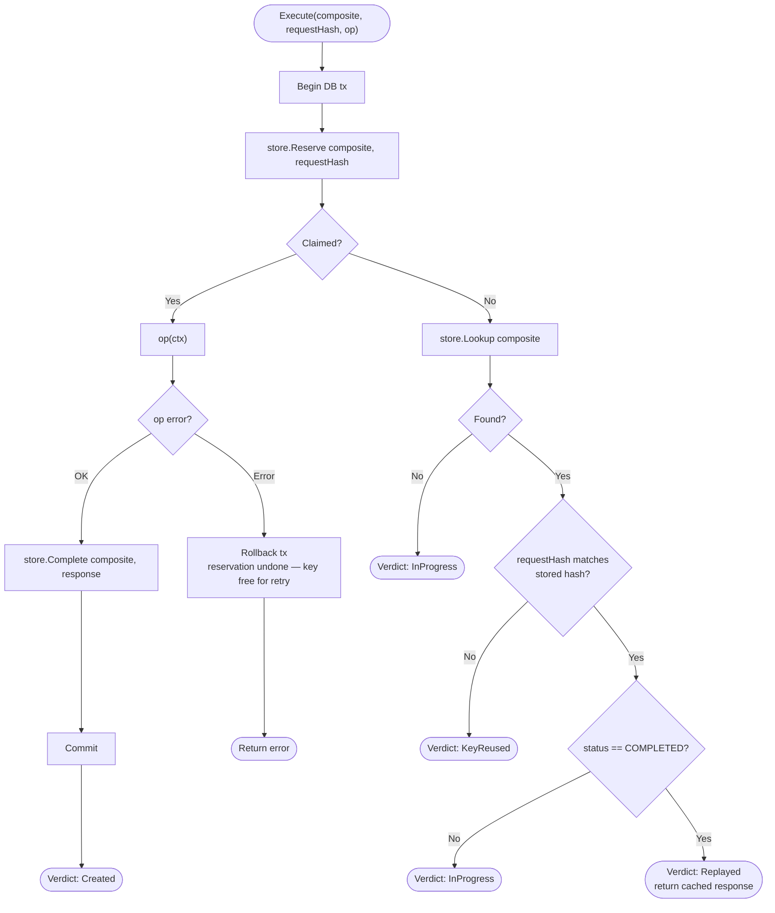
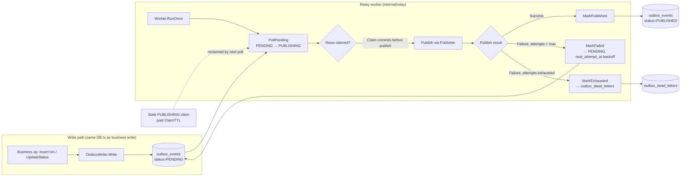
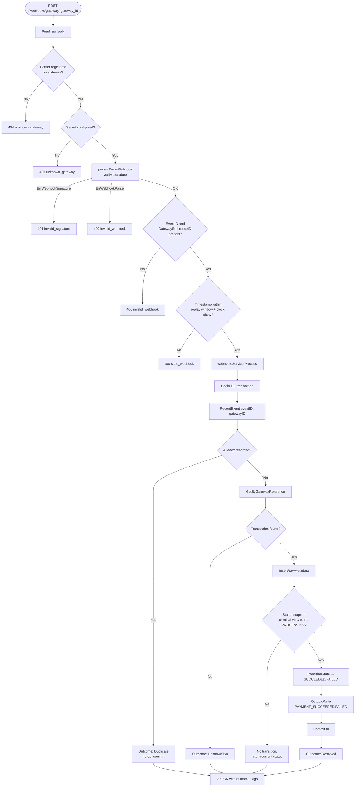
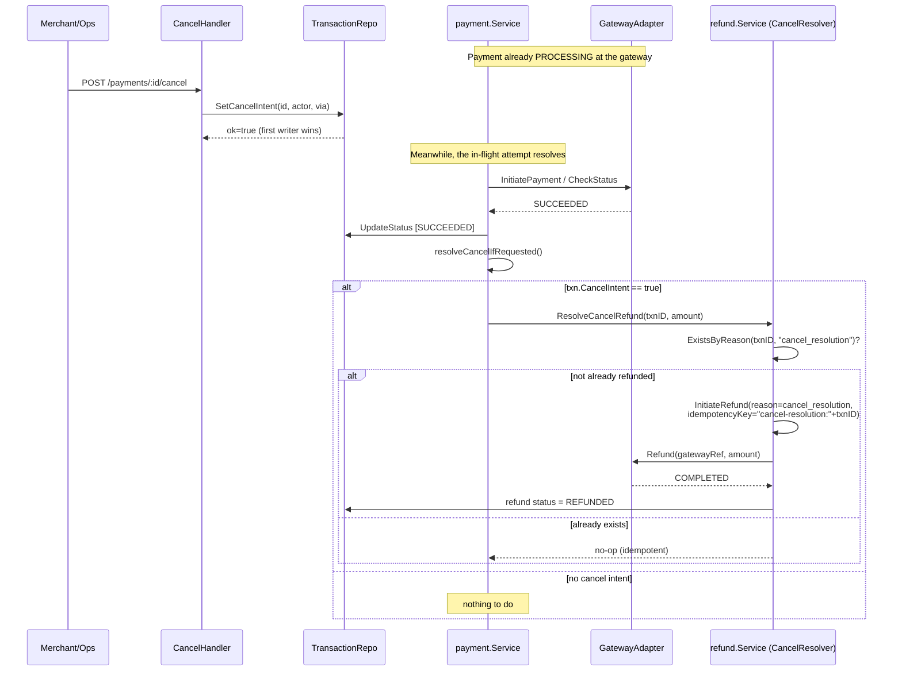
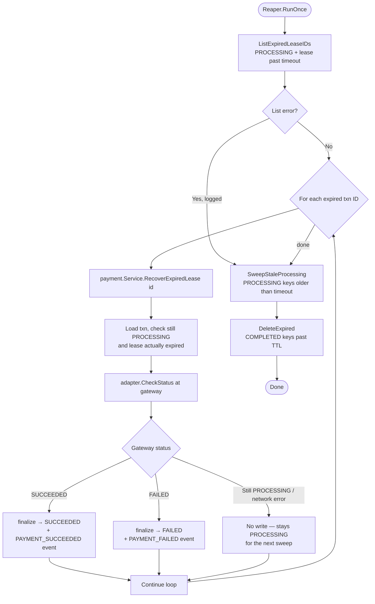

# Payment Service

A backend payment processing service supporting multiple gateways (Stripe, Razorpay, PayU), written in Go using a hexagonal (ports-and-adapters) architecture. It handles payment creation and settlement, refunds, cancellations, inbound gateway webhooks, and the reliability infrastructure (outbox, idempotency, circuit breakers, lease recovery) needed to run payments safely at scale.

This document describes the architecture, the core domain logic, and the operational processes underneath, with diagrams for each major flow.

---

## Table of Contents

- [1. Overview](#1-overview)
- [2. Architecture](#2-architecture)
- [3. Project Layout](#3-project-layout)
- [4. Core Domain: The Transaction Lifecycle](#4-core-domain-the-transaction-lifecycle)
- [5. Creating and Processing a Payment](#5-creating-and-processing-a-payment)
- [6. Gateway Routing](#6-gateway-routing)
- [7. Gateway Fallback and Retry Semantics](#7-gateway-fallback-and-retry-semantics)
- [8. Circuit Breaker](#8-circuit-breaker)
- [9. Idempotency](#9-idempotency)
- [10. Transactional Outbox and Relay](#10-transactional-outbox-and-relay)
- [11. Inbound Webhooks](#11-inbound-webhooks)
- [12. Refunds and Cancellation](#12-refunds-and-cancellation)
- [13. Lease-Expiry Reaper](#13-lease-expiry-reaper)
- [14. Partition Management](#14-partition-management)
- [15. Rate Limiting](#15-rate-limiting)
- [16. Authentication and Authorization](#16-authentication-and-authorization)
- [17. Transport Security (mTLS)](#17-transport-security-mtls)
- [18. Field-Level Encryption](#18-field-level-encryption)
- [19. Observability](#19-observability)
- [20. API Reference](#20-api-reference)
- [21. Configuration](#21-configuration)
- [22. Running Locally](#22-running-locally)
- [23. Testing](#23-testing)

---

## 1. Overview

The service is split into three deployable binaries that share the same domain and adapter code:

| Binary | Path | Responsibility |
|---|---|---|
| **api** | `cmd/api` | HTTP server: create/process payments, refunds, cancellations, receive gateway webhooks, health checks |
| **relay** | `cmd/relay` | Polls the transactional outbox and publishes domain events downstream |
| **jobs** | `cmd/jobs` | One-shot scheduled jobs: `partition_manager` (outbox table partitioning) and `lease_expiry` (stuck-transaction recovery + idempotency-key cleanup) |

Supported payment gateways: **Stripe**, **Razorpay**, **PayU** (`internal/adapters/gateways/*`), each behind a common `ports.GatewayAdapter` interface so the core payment/refund logic is gateway-agnostic.

Supported payment methods: card, UPI, netbanking, wallet (varies by gateway capability).

Key reliability properties the service is built around:

- **No lost writes**: every state change that must also emit an event does so inside one DB transaction via the **transactional outbox** pattern.
- **No duplicate side effects**: idempotency is enforced both at the HTTP layer (whole-response caching) and the business layer (`idempotency.Guard`), plus a DB-level advisory lock on the parent transaction for refund sums.
- **No double-charging on ambiguous gateway failures**: the fallback logic distinguishes "definitely declined" (safe to retry elsewhere) from "unknown, maybe charged" (never retried automatically).
- **Self-healing on stuck payments**: a background reaper reconciles any transaction whose processing lease expired without a resolution.

---

## 2. Architecture



The design follows **hexagonal architecture**:

- `internal/domain/` — pure business rules with no I/O: the transaction state machine, refund invariants (over-refund protection), routing scoring, circuit breaker state machine, reconciliation eligibility rules.
- `internal/app/` — use-case orchestration: takes domain objects and ports (interfaces), coordinates transactions, calls gateways, writes outbox events.
- `internal/ports/` — interfaces the app layer depends on (`GatewayAdapter`, `Logger`, `MetricRecorder`, `OutboxWriter`, `ConfigStore`, …), so the app layer never imports a concrete adapter.
- `internal/adapters/` — concrete implementations: Postgres repositories, Redis rate limiter/circuit-breaker store, gateway HTTP clients, TLS manager, envelope encryption, slog-based logger.
- `internal/api/` — HTTP-specific concerns: routing, middleware, request/response DTOs.

---

## 3. Project Layout

```
cmd/
  api/            HTTP server entrypoint
  jobs/            partition_manager & lease_expiry job entrypoint
  relay/           outbox relay worker entrypoint
config/            environment-variable driven configuration + validation
internal/
  domain/
    transaction/   Transaction entity + state machine
    refund/        Refund entity + over-refund guard
    routing/       Gateway scoring/selection algorithm
    gateway/       Circuit breaker state machine, discrepancy metrics
    reconciliation/ Settlement mismatch types + auto-resolution eligibility
  app/
    payment/       CreatePayment, ProcessPayment, RecoverExpiredLease
    refund/        InitiateRefund, ProcessRefund, ResolveCancelRefund
    cancel/        Cancel intent handling
    webhook/       Inbound webhook → transaction resolution
    routing/       Router orchestration around domain/routing
    idempotency/   Reserve/Lookup/Complete guard used by payment & refund
  adapters/
    postgres/      Repositories, migrations-backed queries, Transactor
    redis/         Rate limiter (token bucket, Lua), circuit breaker store
    gateways/      stripe/, razorpay/, payu/ adapters + webhook parsers
    security/      mTLS certificate manager
    encryption/    Envelope encryption (KMS-style key manager)
    observability/ slog logger with field redaction, no-op metrics
  api/
    handlers/      HTTP handlers (payment, refund, cancel, webhook, health)
    middleware/    Auth, RateLimit, Idempotency, RequestID, Recover
  jobs/
    partition_manager/  Weekly outbox partition lifecycle
    lease_expiry/       Stuck-transaction reaper + idempotency-key sweep
  relay/           Generic outbox polling worker + publisher interface
  ports/           All interfaces + shared types (GatewayAdapter, Logger, ...)
  testsupport/     Shared Postgres/Redis test harness
test/integration/  End-to-end tests exercising real Postgres/Redis
```

---

## 4. Core Domain: The Transaction Lifecycle

Every payment is represented by a `Transaction` with a strictly enforced state machine (`internal/domain/transaction/state_machine.go`). Invalid transitions return `ErrInvalidTransition` rather than silently mutating state, and transitions out of `PROCESSING` clear the processing lease fields.



Notable rules baked into `transaction.go` / `state_machine.go`:

- `PENDING`, `PROCESSING`, `SUCCEEDED`, `FAILED`, `CANCELLED`, `REFUNDED`, `REFUND_FAILED` are the only statuses (`AllStatuses()`).
- `IsTerminal()` is true for `SUCCEEDED`, `CANCELLED`, `REFUNDED`, `REFUND_FAILED` — note that `SUCCEEDED` is terminal for the *payment* even though a refund can still be attached afterward.
- A transaction carries `Version` for **optimistic locking**: `UpdateStatus` fails with `ErrVersionConflict` if the stored version doesn't match, and `ErrNotFound` (a distinct case) if the row simply doesn't exist.
- `AttemptedGateway` vs `ActualGateway` are tracked separately so a fallback to a different gateway is visible (`HasGatewayDiscrepancy()`).

---

## 5. Creating and Processing a Payment

`POST /payments` is handled synchronously end-to-end in the current implementation: create, then immediately attempt processing. If processing fails transiently, the client still gets back a `202 Accepted` with the `PENDING`/`PROCESSING` transaction, and the lease-expiry reaper (§13) will pick it up later if it gets stuck.



Key implementation details:

- **`Idempotency-Key` is mandatory** on `POST /payments` and `POST /payments/{id}/refunds`. It's combined with `merchantID + operation` into a composite hash (`idempotency.Composite`), and the request body is hashed (`idempotency.RequestHash`) to detect key reuse with a different payload (→ `409 idempotency_key_reused`).
- **The processing lease** (`processing_lease` table, `LeaseStore.Acquire`) prevents two concurrent `ProcessPayment` calls (e.g., a client retry racing the reaper) from both calling the gateway. If the lease isn't acquired, the current (possibly still-`PENDING`) transaction is returned untouched.
- **`EstimatedTimeoutSeconds`** comes from `ConfigStore.GetProcessingTimeout(gateway, method)` and becomes the lease TTL — it must be positive or transaction creation fails.
- If `ProcessPayment` errors after a successful `CreatePayment` (e.g. gateway adapter unavailable), the handler returns **`202 Accepted`** with the created-but-unprocessed transaction rather than failing the whole request.

---

## 6. Gateway Routing

`internal/domain/routing` implements a weighted-scoring gateway selection algorithm, orchestrated by `internal/app/routing.Router`.

Filtering (candidates are dropped before scoring, `filterReason`):
- Inactive gateway
- Amount outside `[MinAmount, MaxAmount]`
- Currency not supported
- Live circuit breaker `OPEN` and still within cooldown
- 24h discrepancy rate > 20%

Scoring (each candidate gets a 0–100 sub-score per dimension, combined via configurable `Weights` that must sum to 1.0, ±0.001 tolerance, with at most 2 zero-weighted dimensions):

| Dimension | Signal |
|---|---|
| Volume | Relative to the highest 7-day volume among candidates |
| Cost | Relative to the highest calculated fee among candidates (cheaper = higher score) |
| Reliability | `1 - discrepancyRate24h`, or the last known score if the breaker is `OPEN` |
| FX efficiency | Always 100 for domestic currency; otherwise the pre-computed FX ratio |
| Latency | Based on p99 latency vs. the configured SLA |

Ties within 1 point (100 in the ×100-scaled integer score) are broken first by **fewer active payment intents**, then **lexicographically by gateway ID** — deterministic and reproducible.

The router also checks the **live** circuit-breaker state from Redis (via `BreakerStateReader`), not just the config snapshot, and treats an `OPEN` breaker whose cooldown has elapsed as `HALF_OPEN` (a legal routing target — enabling the probe described in §8), falling back to the config snapshot if Redis is unavailable ("fail open to config").

---

## 7. Gateway Fallback and Retry Semantics

This is the part of the payment flow most sensitive to correctness: **not all gateway failures are safe to retry on a different gateway.** `internal/app/payment/process.go`'s `attemptGateways` encodes this explicitly by error category.



Why each category behaves the way it does:

- **`HardDecline`** (e.g. `card_declined`, `expired_card`): the card/account was genuinely rejected. Retrying on a *different* gateway wouldn't change the outcome and can look like fraud probing, so it's terminal `FAILED` immediately. It also counts as a **breaker success**, because a decline proves the gateway itself is healthy and responsive.
- **`SoftDecline`** (e.g. `insufficient_funds`, `try_again_later`): plausibly transient or issuer-side, and *not* an indication the gateway already captured funds — safe to retry elsewhere, bounded by `SetMaxGatewayAttempts(n)` (default 1 attempt, i.e. no fallback unless explicitly configured).
- **`NetworkTimeout` / `Ambiguous`**: the request may or may not have reached the gateway, or a response may have been lost in transit. The transaction is deliberately left **non-terminal** (`PROCESSING`) rather than guessed at — no outbox event is written, and it's the lease-expiry reaper's job (§13) to later call `CheckStatus` and resolve it definitively.
- **`GatewayError`** (5xx / unexpected gateway failures): treated the same as ambiguous for *fallback* purposes — it is **never** retried on a different gateway, because the first gateway might have accepted and processed the charge despite returning an error. It does finalize as `FAILED` here specifically for the synchronous attempt path (distinct from the reaper's more conservative "leave it alone" handling of the same category during recovery).
- **Circuit breaker recording**: `NetworkTimeout`, `GatewayError`, and `Ambiguous` all count as **breaker failures** (they indicate gateway-side health problems); `HardDecline` and `SoftDecline` do not.

The fallback loop tracks every gateway ID already tried (`tried []string`) and passes it to the router as `ExcludeGateways`, so a second attempt can never retry the same gateway that just failed.

---

## 8. Circuit Breaker

`internal/domain/gateway` defines the state machine; `internal/adapters/redis.CircuitBreakerStore` persists it atomically via Lua scripts (`RecordFailure`, `RecordSuccess`, `Transition`) so concurrent API instances agree on state without races.



- **Cooldown escalation**: `CooldownDuration(n)` doubles per consecutive failure (60s, 120s, 240s), capped at 240s, so a gateway that keeps failing right after being re-enabled gets progressively longer timeouts instead of hammering it every 60 seconds.
- **Single-flighted probing**: `AcquireProbe` uses a Redis `SETNX` so that when a breaker's cooldown has elapsed, only one in-flight request is allowed to "probe" the gateway (routed as if `HALF_OPEN`) while others still treat it as unavailable — avoiding a thundering herd hitting a gateway the moment its cooldown lapses.
- **Fail-open on Redis outage**: if the breaker store itself is unreachable, `Router.liveBreakerState` falls back to the last-known state from the config snapshot rather than blocking all routing decisions on Redis being up.
- Only `CLOSED → OPEN`, `OPEN → HALF_OPEN`, and `HALF_OPEN → {CLOSED, OPEN}` are legal; anything else (e.g. `CLOSED → HALF_OPEN` directly) is rejected by the transition script.

---

## 9. Idempotency

Idempotency is enforced at **two layers**, both following the same Reserve → run-or-lookup → Complete shape:

1. **HTTP layer** (`middleware.Idempotency`): caches the *entire HTTP response* (status + body) keyed by `merchant + method + path + Idempotency-Key`, scoped per merchant so two different merchants can safely reuse the same key string.
2. **Business layer** (`app/idempotency.Guard`): used inside `payment.Service.CreatePayment` and `refund.Service.InitiateRefund` to guard the underlying domain operation itself (insert + outbox write), independent of how it's invoked.



Four possible verdicts, mapped to distinct HTTP outcomes by the handlers:

| Verdict | Meaning | HTTP response |
|---|---|---|
| `Created` | First time seeing this key; op ran | `201 Created` |
| `Replayed` | Op already completed; cached response returned | `200 OK` |
| `InProgress` | Another request with this key is still running | `409 idempotency_in_progress` |
| `KeyReused` | Same key, different request body | `409 idempotency_key_reused` |

A failed op **rolls back the reservation** (the whole guard runs inside `Transactor.WithinTx`), so a request that errors midway doesn't permanently strand the key — a retry can claim it fresh. At the HTTP layer specifically, a `5xx` response is deliberately **not cached** and the reservation is released, for the same reason.

---

## 10. Transactional Outbox and Relay

Every state change that needs to notify the outside world writes an `outbox_events` row **inside the same database transaction** as the state change itself (`OutboxWriter.Write` requires an ambient tx via `WithTx`). This guarantees the event is never lost (it's part of the same atomic commit) and never emitted for a change that didn't actually persist (it's rolled back together).



Design points that matter operationally:

- **Claim-before-publish, not select-then-publish**: `PollPending` atomically transitions matched rows `PENDING → PUBLISHING` (or reclaims stale `PUBLISHING` rows past `ClaimTTL`, default 60s) and *commits that claim* before the caller ever calls `Publish`. An earlier design that used `SELECT ... FOR UPDATE SKIP LOCKED` without committing the claim first would let two relay workers both fetch and publish the same event, since the row lock released at commit time — after publishing, not before.
- **Backoff on failure**: a failed publish sets `next_attempt_at` using exponential backoff (`Worker.backoff`, base × 2^attempts, capped at `MaxBackoff`) and returns the event to `PENDING` for retry, up to `MaxAttempts` (default 5).
- **Dead-lettering**: once attempts are exhausted, `MarkExhausted` moves the event to `outbox_dead_letters` in the same transaction it removes/marks the original — replayable later via `ReplayDeadLetter`, which re-enqueues a **new** event ID rather than resurrecting the old one.
- **Shard-aware polling**: `PollPending(shardMin, shardMax, ...)` lets multiple relay workers split the keyspace so they don't compete for the same rows, without needing external partitioning of workers.
- **Weekly partitioning**: `outbox_events` itself is a partitioned table (see §14) so old, fully-published partitions can be detached and dropped instead of bloating one ever-growing table.

---

## 11. Inbound Webhooks

`POST /webhooks/gateway/{gateway_id}` receives asynchronous status updates from gateways and reconciles them against the internal transaction record.



Security and correctness details:

- **Per-gateway signature verification** is delegated to each adapter's `ParseWebhook` (`GatewayWebhookParser`): Stripe verifies an HMAC-SHA256 over `timestamp.body` and rejects payloads outside a 300-second tolerance window; Razorpay verifies an HMAC-SHA256 header signature; PayU verifies its SHA-512 "reverse hash" over form fields (including the optional `additionalCharges` field, which changes the digest if present).
- **Duplicate delivery is a no-op, not an error**: gateways commonly redeliver webhooks; `RecordEvent` uses a unique constraint on `(event_id, gateway_id)` so a redelivery is detected and short-circuited before any transaction mutation, still returning `200 OK`.
- **Only `PROCESSING` transactions are mutated**, and only for a status that maps to a terminal outcome (`succeeded/success/captured/paid` → `SUCCEEDED`; `failed/failure` → `FAILED`). A webhook arriving for an already-terminal or non-`PROCESSING` transaction is accepted but causes no transition — this prevents a stale or out-of-order webhook from clobbering a status that a different code path (e.g. the reaper) already resolved.
- **Timestamp/replay-window check** (`checkTimestamp`) is optional per gateway (`ConfigStore.WebhookPolicy`) and only enforced if the gateway sends an `X-Webhook-Timestamp` header.

---

## 12. Refunds and Cancellation

### Refund invariants

`domain/refund.New` refuses to construct a refund that would push `alreadyRefunded + amount` past the original transaction amount, returning a typed `ErrOverRefund` — checked against a `SELECT ... FOR UPDATE`-style lock on the parent transaction (`LockParentTransaction`) so concurrent refund requests can't race past the cap.

Refund gateway outcomes follow the same "don't guess on ambiguity" principle as payments: a `GatewayError`/`NetworkTimeout`/`Ambiguous` response leaves the refund in `REFUND_PROCESSING` rather than declaring `REFUND_FAILED` (which would invite an unsafe retry that could double-refund).

### Cancel-intent race with a still-succeeding payment

The most interesting correctness case in the service: a merchant/ops cancel request can land *while a payment is still in flight at the gateway*. If the gateway ends up honoring the payment anyway, the service must notice and auto-refund exactly once.



Why this is safe under concurrency:

- **`SetCancelIntent`** is a single conditional `UPDATE` — only the first caller for a given transaction wins (`TestCancel_ConcurrentSingleIntent` proves exactly one winner under 16 concurrent callers), and it's a no-op on already-terminal transactions (`CancelService.Cancel` returns `ALREADY_TERMINAL` without writing).
- **`ResolveCancelRefund` is doubly idempotent**: it checks `ExistsByReason(txnID, "cancel_resolution")` before initiating anything, *and* the refund itself is initiated with a deterministic idempotency key (`"cancel-resolution:" + txnID`), so even if the finalize path somehow ran twice (e.g. reaper + synchronous path both resolving the same lease), only one `cancel_resolution` refund is ever created.
- **`FAILED → CANCELLED` still requires `CancelIntent`** at the state-machine level (§4) — cancellation is never implicit, it's always driven by an explicit recorded intent.

---

## 13. Lease-Expiry Reaper

A payment that got stuck `PROCESSING` — because the synchronous attempt hit a `NetworkTimeout`/`Ambiguous`/`GatewayError` and correctly declined to guess — needs something to eventually resolve it. That's the `lease_expiry` job (`cmd/jobs JOB=lease_expiry`), intended to run on a schedule (e.g. every minute).



- **Status-check, never a blind retry**: `RecoverExpiredLease` calls `CheckStatus` (a read-only query against the gateway) rather than re-attempting `InitiatePayment`, so it can never create a duplicate charge — it only ever finds out what already happened and records that truth.
- **One failure doesn't abort the batch**: each transaction ID is recovered independently; a single recovery error is logged and the loop continues to the rest (`TestReaper_PerItemFailureDoesNotAbortSweep`).
- **Piggy-backed idempotency-key hygiene**: the same run also sweeps `idempotency_keys` rows — `PROCESSING` rows older than `IdempotencyProcessingTimeout` (default 5 minutes, meaning a crashed request that never called `Complete`/rolled back cleanly) are cleared so retries aren't blocked forever, and `COMPLETED` rows past their TTL are purged to bound table growth.

---

## 14. Partition Management

`outbox_events` is partitioned **weekly** (`outbox_YYYY_Wnn`, ISO week numbering) to keep the hot table small and make old data cheap to age out. The `partition_manager` job (`cmd/jobs JOB=partition_manager`) maintains this on a schedule.

Responsibilities, all guarded by a single Postgres advisory lock (`AcquireLock`/`ReleaseLock`) so only one instance does this work at a time even if the job is scheduled redundantly:

1. **Pre-create ahead**: creates partitions for the current ISO week plus `WeeksAhead` (default 2) weeks in advance, so writes never land in a fallback `outbox_default` partition due to a missing partition.
2. **Detach stale, empty partitions**: a partition older than `RetentionWeeks` (default 2) is detached **only if** `CountUnpublished` reports zero pending/failed rows in it — a partition that still has unpublished events is left alone regardless of age, so the relay always has something to poll.
3. **Drop after a grace period**: partitions detached more than `DropAfter` (default 14 days) ago are physically dropped, giving a window to notice a mistake before data is gone for good. Every detach/drop is also recorded via `LogAction` for an audit trail.

---

## 15. Rate Limiting

`internal/adapters/redis.RateLimiter` implements a **token-bucket** algorithm executed atomically in Redis via a Lua script (`scripts/token_bucket.lua`), keyed on three independent dimensions simultaneously — user, merchant, and IP — so exhausting one dimension's bucket doesn't consume tokens from the others.

- **Local in-memory fallback**: if Redis is unavailable for `failureThreshold` (3) consecutive calls, the limiter flips to a local, per-process token bucket sized at `capacity × FallbackMultiplier` (default 0.5 — deliberately more conservative than the Redis-backed limit), backed by an LRU (`container/list`) capped at `LocalMaxBuckets` to bound memory. A background health check restores the Redis-backed path once it recovers.
- **Merchant bucket key comes from the authenticated principal**, never a client-supplied header — `merchantBucketID` reads from request context (set by the auth middleware), so a spoofed `X-Merchant-ID` header can't be used to attribute load to (or rate-limit) a different merchant.
- Rejections return `429` with a computed `Retry-After` header (minimum 1 second).

---

## 16. Authentication and Authorization

`middleware.Authenticate` supports two static, pre-shared-token principal types configured via environment variables:

- **Service tokens** (`X-Service-Token`) map to a specific `MerchantID` — the merchant identity is *bound to the token*, not read from any request header, which is what makes the rate-limiter merchant-key spoofing protection in §15 possible.
- **Ops tokens** (`X-Ops-Token`) grant the `ops` role without a merchant binding (used for cancel/refund operational actions).

Tokens are stored hashed (SHA-256) in memory; `/health` and `/webhooks/*` are exempt from authentication (webhooks authenticate via gateway signature instead, §11). If no tokens are configured at all, auth middleware is skipped entirely and a warning is logged — appropriate for local development, not for production.

---

## 17. Transport Security (mTLS)

`internal/adapters/security.Manager` wraps Go's `crypto/tls` to support mutual TLS with **hot certificate rotation**:

- Loads the server keypair and (optionally) a client-CA pool; if `MtlsStrictMode` is enabled, unauthenticated/untrusted client certificates are rejected (`RequireAndVerifyClientCert`), otherwise client certs are verified only if presented (`VerifyClientCertIfGiven`).
- `StartRefresh(ctx)` runs a background ticker (`CertRefreshIntervalSec`) that reloads the certificate and CA pool from disk without restarting the process — new connections pick up the rotated cert immediately via `GetConfigForClient`, existing connections are unaffected.
- If `TLS_CERT_FILE` isn't configured, the server runs plain HTTP (suitable for local dev or when TLS is terminated upstream, e.g. behind a load balancer).

---

## 18. Field-Level Encryption

`internal/adapters/encryption` implements **envelope encryption** for sensitive fields (not currently wired into a specific column in the shown code, but available as infrastructure):

- A `KeyManager` (local AES-GCM implementation provided; swappable for a real KMS) generates and unwraps per-use **data encryption keys (DEKs)**, each wrapped under a master key with the key ID bound as authenticated-associated-data (AAD) — so a DEK wrapped under one key ID can never be unwrapped under a different one, even with the same master key.
- `Envelope` caches a current DEK and reuses it across encryptions up to `MaxDEKUses` (default ~1M) or `DEKTTL` (default 1h), whichever comes first, avoiding a KMS round-trip per encryption while still rotating regularly.
- A separate **decrypt-side cache** (`dekCache`, keyed by a hash of the wrapped DEK, TTL default 1h) avoids re-unwrapping the same DEK repeatedly when decrypting many records that share it.
- All ciphertext is authenticated (AES-GCM) and bound to caller-supplied AAD (e.g. `"transaction:card:tx-1"`), so ciphertext can't be replayed into a different field/record context even by an attacker who can write to the database.

---

## 19. Observability

- **Structured logging** (`internal/adapters/observability.SlogLogger`) wraps `log/slog` with a custom `TRACE` level below `DEBUG`, and **automatically redacts** known-sensitive field keys (`vpa`, `card_number`, `pan`, `cvv`, `card_cvv` — case-insensitive) to `[REDACTED]` before they're ever written to output.
- **Error-log contract enforcement**: `Logger.Error` checks for required fields (`error_code`, `trace_id`, `transaction_id`) on every call and appends a `log_validation_error` note if any are missing — a lightweight guardrail against error logs that are hard to correlate later, without failing the call itself.
- **Metrics**: a `MetricRecorder` port is defined with counters/histograms/gauges for transaction outcomes, gateway fallback/circuit-breaker events, outbox publish latency/failures, rate-limiter fallback activity, and reconciliation mismatch rates (see `internal/ports/metrics.go` for the full catalog); the shipped implementation (`NewNoopMetrics`) is a no-op, ready to be swapped for a real backend (StatsD/Prometheus/etc.).

---

## 20. API Reference

| Method | Path | Auth | Description |
|---|---|---|---|
| `GET` | `/health` | none | DB connectivity check |
| `POST` | `/payments` | service/ops token | Create + immediately attempt a payment. Requires `Idempotency-Key`. |
| `GET` | `/payments/{id}` | service/ops token | Fetch a transaction by ID |
| `POST` | `/payments/{id}/refunds` | service/ops token | Initiate + immediately attempt a refund. Requires `Idempotency-Key`. |
| `POST` | `/payments/{id}/cancel` | service/ops token | Request cancellation (idempotent; safe on already-terminal transactions) |
| `POST` | `/webhooks/gateway/{gateway_id}` | gateway signature | Inbound gateway status callback |

Common error shape: `{"error": {"code": "...", "message": "..."}}`. Notable status codes beyond the obvious 200/201/400/404:

- `202 Accepted` — created/initiated, but the synchronous processing attempt failed (client should poll `GET /payments/{id}`)
- `409` — `idempotency_in_progress` or `idempotency_key_reused`
- `422` — `no_eligible_gateway`, `not_refundable`, or `over_refund`
- `429` — rate limited (`Retry-After` header set)

---

## 21. Configuration

All configuration is via environment variables, loaded and validated in `config/config.go` (`LoadConfig` fails fast with an aggregated list of every missing/invalid value). Highlights by area:

| Area | Key variables | Notes |
|---|---|---|
| App | `ENVIRONMENT` (prod/staging/dev), `PORT`, `MTLS_STRICT_MODE` | |
| Database | `DATABASE_PRIMARY_HOST`, `DATABASE_REPLICA_HOST`, `DATABASE_NAME/USER/PASSWORD`, `DATABASE_SSL_MODE` | Pool sizing via `DATABASE_MAX_OPEN_CONNS` etc. |
| Redis | `REDIS_ADDRS` (comma-separated), separate DBs for rate-limit vs. cache | |
| Outbox | `OUTBOX_RELAY_MODE` (`cdc`\|`polling`), `OUTBOX_RELAY_BATCH_SIZE`, `OUTBOX_RELAY_MAX_ATTEMPTS`, WAL-lag alert thresholds | Shard count fixed at 64 by schema |
| Rate limit | `RATE_LIMIT_FALLBACK_MULTIPLIER` (0,1], `RATE_LIMIT_LOCAL_MAX_BUCKETS` | |
| Routing | `ROUTING_SNAPSHOT_TTL_SECONDS`, `GATEWAY_FEE_CACHE_TTL_SEC`, `FX_RECONCILIATION_TOLERANCE_PCT` | |
| Security | `TLS_CERT_FILE/KEY_FILE/CA_FILE`, `TLS_CERT_REFRESH_INTERVAL_SECONDS`, `DEK_CACHE_TTL_SECONDS` | TLS optional; omit to run plain HTTP |
| Jobs | `LEASE_EXPIRY_INTERVAL_SECONDS`, `JOB_LOCK_TIMEOUT_MINUTES` | |
| Gateways | `STRIPE_API_KEY`, `RAZORPAY_KEY_ID`/`RAZORPAY_KEY_SECRET`, `PAYU_MERCHANT_KEY`/`PAYU_MERCHANT_SALT`, plus `*_BASE_URL` overrides for testing | |
| Auth | `SERVICE_TOKENS` (`token=merchantID,...`), `OPS_TOKENS` (comma-separated) | Omit entirely to disable auth (dev only) |

`Validate(c)` additionally enforces cross-field invariants, e.g. `OUTBOX_RELAY_WAL_LAG_ALERT_THRESHOLD_MB < OUTBOX_RELAY_WAL_LAG_CRITICAL_THRESHOLD_MB`.

---

## 22. Running Locally

```bash
# Start Postgres + Redis for local/integration use
docker compose -f deploy/docker/docker-compose.test.yml up -d

# Run the API server (see §21 for required env vars)
go run ./cmd/api

# Run the outbox relay
go run ./cmd/relay

# Run a one-shot job
JOB=partition_manager go run ./cmd/jobs
JOB=lease_expiry go run ./cmd/jobs
```

---

## 23. Testing

- **Unit tests** live alongside the code they test (`*_test.go`) and use hand-written fakes for every port (`fakeRepo`, `fakeOutbox`, `fakeRegistry`, …) — no mocking framework, no real I/O.
- **Integration tests** (`test/integration/`, and `*_integration_test.go` under `adapters/postgres` and `adapters/redis`) are gated behind the `integration` build tag and require the Postgres/Redis containers above; they exercise real concurrency (goroutine races against actual row locks, actual Redis Lua scripts) for things a fake can't prove, e.g.:
  - Exactly one winner among concurrent refund/cancel-intent/lease-acquire attempts
  - Optimistic-lock conflicts under concurrent `UpdateStatus`
  - Outbox claim visibility (a claimed event is invisible to a second poller) and stale-claim reclamation
  - Circuit-breaker cooldown escalation across repeated re-opens
  - Rate-limiter atomicity under 50 concurrent goroutines against a capacity of 10

Run unit tests: `go test ./...`
Run integration tests: `go test -tags=integration ./...` (with the docker-compose stack running)
